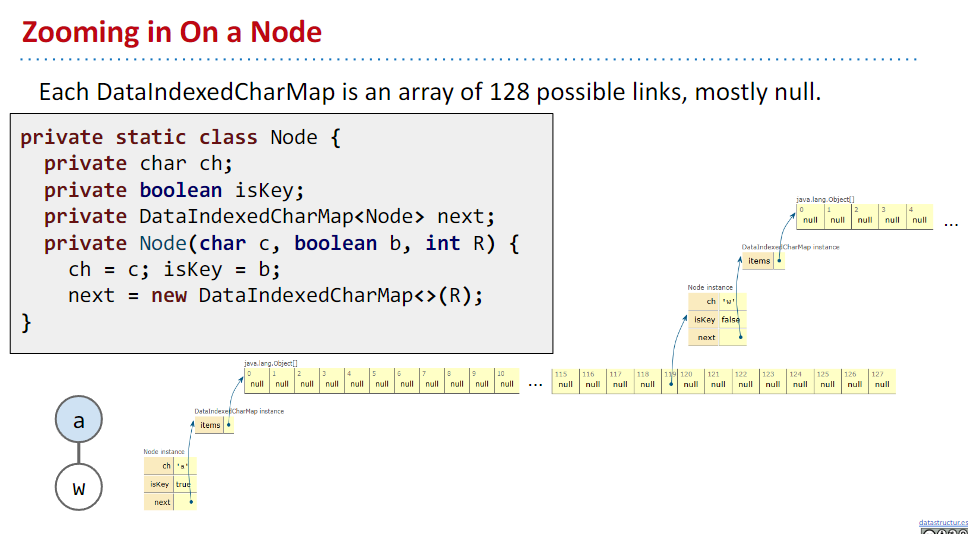
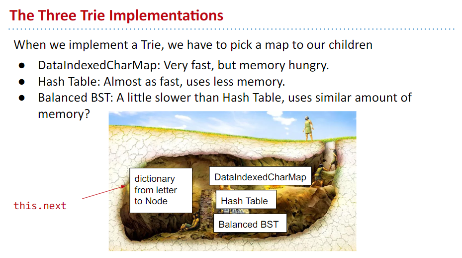
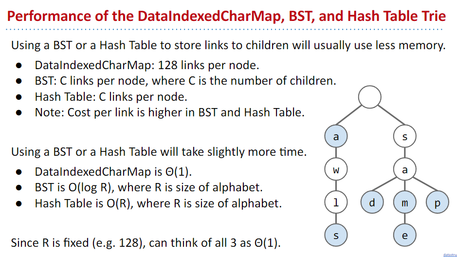

# week 10 lectures

## lecture 26 Prefix Operations and Tries

- Trie, 一种功能类似 Set 或 Map 的结构，保存的 key 通常是字符串类型，针对字符串的查询、插入的操作性能好。
- 形态是一棵树，节点保存字符，以及到下一个节点的连接。

TrieSet 的接口定义如下：

```java
public class TrieSet {
  private static final int R = 128; // ASCII
  private Node root;	// root of trie

  private static class Node {
    private char ch;  
    private boolean isKey;   
    private DataIndexedCharMap<Node> next;
    private Node(char c, boolean b, int R) {
       ch = c; isKey = b;
       next = new DataIndexedCharMap<>(R);
    }
 }
}
```

如果字符是 ASCII 编码，则每个节点要保存 128 种可能情况，用 DataIndexedCharMap（底层是个数组数组）来表示，是一个容量为 128 的数组，字符对应索引，索引处的值是下一个节点，如下图：



每个节点都要用一个 128 长度的数组，其中很多的位置可能是空的，内存消耗消耗大户。为了节省内存占用，可以用哈希表或 BST 实现一个节点：



各自它们的性能表现有所不同：



哈希表和 BST 能大大节省内存占用，但它们操作起来更耗时一点。

## lecture 27 Software Engineering I

控制复杂度，要点：
   1. 将代码写得清晰明白，尽可能地通用；
   2. 模块化分离代码

## lecture 28 Reductions and Decomposition

Topological Sorting：有一些任务，做起来有先后顺序，要把这些顺序找出来，要做拓扑排序。

- 生成拓扑排序：一个图的拓扑排序结果是一个列表，列表中的节点顺序是访问节点的先后顺序。
- 过程：
   1. 找到 indegree 为 0 的节点，作为起始节点；
   2. 从起始节点开始运行后序的dfs(深度优先搜索)；
      - 后序指处理（visit）节点是先处理子节点，再处理自身，就 dfs 来说，处理操作就是标记为已访问的操作
   3. 将得到的节点倒序就是拓扑排序后的结果
- 为什么叫拓扑排序：排序后的节点的箭头都统一向右指。
- DAG：Directed Acyclic Graph 有向无环图，拓扑排序只在有向无环图中存在。
- 如何找到一个 DAG（含负数边的情况）的最短路径树？
   1. 将 DAG 执行拓扑排序，得到节点列表；
   2. 按照节点列表的顺序执行 Dijkstra's 算法，得到最短路径树

- 为什么按照拓扑排序后的节点顺序执行 Dijkstra's 算法能兼容负边的情况？
   1. Dijkstra's 算法在边的权重都为正的情况下能得到 SPT，因为在算法执行过程中，后续遇到的边的权重一定是增长的，所以当下找到的最小增长的边，也是全局下这条边的最小增长情况。引入负边后，打破了局部最优即全局最优的情况，会出现当前确定为最短路径的节点，在后续的遍历中出现了更短路径的情况，每个节点都面临这种可能性，复杂度陡升。
   2. 拓扑排序保证的是，访问一个节点后，就能确定它的最短路径，因为通往这个节点的路径已经提前确定了，且后续不会有节点回头指向该节点，所以只要遍历一次拓扑排序后的节点，就能确定图的最短路径树。这以提前算出图的拓扑排序的为代价。
- 计算图的拓扑排序时间复杂度为 O(V+E)，再执行 Dijkstra's 算法，时间复杂度为 O(V+E)。

- 如何找到一个 DAG 的**最长路径树**？
   - 我的想法是，前面照搬最短路径树的找法，只有在运行 Dijkstra's 算法时，修改过程中的一些判断，使其最短优先改为最长优先，纸笔推导了一下可行。
   - Josh 课程中给的解法是，将所有边取反，得到一个新图，对这个新图执行 DAG 的最短路径树运算，再将结果的边取反以还原，我体会了一下，觉得优雅。

- 一个 DAG 的最长路径树算法，经过将图处理后，可以用最短路径树算法来解，这是一种问题分解的思路（ reduction），是编程的重要思路，之前遇到的将渗流问题（Percolation）用不交集来模拟就是一种分解。

- 广义上的对一个图（有环的情况）找最长路径树，是数学领域一个重要议题，目前它的算法是指数级别的复杂度，约等于不存在现实解。