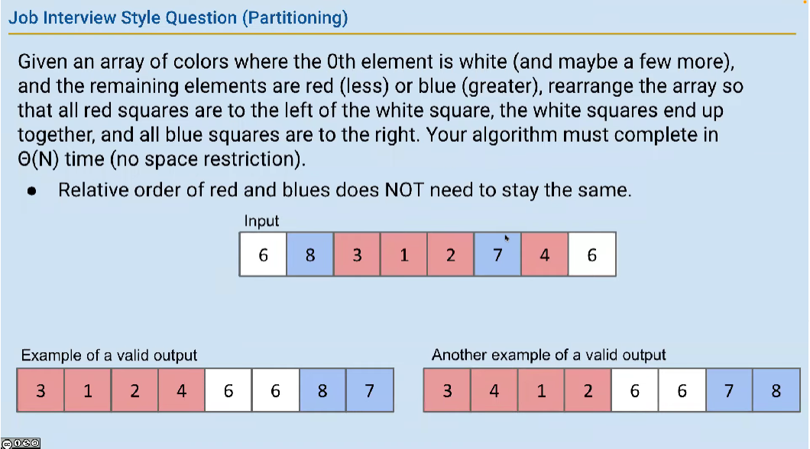

# week 13 lectures notes

## lecture 31 快速排序 I

核心思路——分割（Partition），只为数组中的一个元素进行排序。使得排序后的数组中，它左侧的所有元素都小于等于它，其右侧的元素都大于等于它。数组就该元素为界，分为左右两个子数组，然后继续对左右两个数组进行分割。直到分割的子数组没有或只有1个元素。

我们把随机选出的元素叫 pivot。

快速排序快的原因在于，如果 pivot 选得足够随机，每次分割都将数组对半分，总的分割的次数是 logN 次，每次分割为 pivot 排序的复杂度是 N，所以运行时是 O(N logN)

快速排序的调用栈展开是一种二分搜索树的结构，又可以叫它二分搜索树排序（BST Sort），在 pivot 选得足够随机的情况下，分割时的比较的次数和为这个数组构建一个 BST 的比较次数是一样的。

### 分割算法

分割的问题可用下图描述：

给定一个数组和一个输入值，输入值为白色，将数组中比输入小的标红，大的标蓝，排序数组，使得红色元素在左边，蓝色元素在右边，白色在中间。要求运行时 O(N)，空间复杂度不要求。

分割算有不同的实现：
- 一个最容易理解的解法，遍历三次数组，第一次找红色元素，第二次找白色元素，第三次找蓝色元素，一次添加到新数组，运行时 O(N)，空间复杂度 O(N)，但实际运行时要遍历三次数组，所以不会很快。

- 再如，遍历原数组，遇到比 pivot 大的，从末尾开始插入新数组；遇到小的，从起始位置插入新数组，最后在新数组空余的地方填入 pivot，时间复杂度 O(N)，空间复杂度 O(N)，这种方法只要遍历一次原数组，比上述的快。

### 将分割算法用于快速排序

快速排序过程：
- 接受一个数组，取最左边的元素，基于它进行分割；
- 对左半个数组进行快速排序；
- 对右半个数组进行快速排序

### 快速排序的性能

取决于：
- pivot 的选择
- 分割算法的效率
- 其他可优化的措施

运行时：
- best case：O(N logN)，在数组本身是乱序，且 pivot 选得足够随机情况下
- worst case：O(N^2)，在数组已排序或 pivot 选得是最大/最小值的情况下

快速排序性能优化措施主要围绕避免出现最差情况展开，从概念上，可以做的有：
- 随机化：排序前先打乱数组，使得数组元素分布足够随机，这样取到的 pivot 也随机
- 智能 pivot 选择：排序前先遍历数组，找到其中的中间值，使得 pivot 随机
- 监控自身的实施过程：让排序算法有能力观察自己的执行过程，如快排的调用栈太深，就换用其他排序
- 预处理数组：如遍历数组，看是否已排序（概念上可行，实际上没什么有效方法来做）

### 快速排序的实现

实现快速排序时，要考虑一些细节问题，如 partionting 返回什么？用 ts 实现了一个快速排序，其中的分割算法是自己想的，见 `./quick-sort.ts`

## lecture 32 快速排序 II

### 避免快速排序的最差情况

从三个方向优化：

- pivot 选择
- 分割算法
- 避免 worst case 的措施

这三个方向各自有不同的措施，我们给这样优化后的快速排序定一个命名规则，如果它在：
  - pivot 选择：选最左边的元素（**L**）
  - 分割算法：需要遍历 3 次原始数组（**3**）
  - 每次开始前都打乱（**Shuffle**）数组，避免 worst case（S）
  - 我们叫这个快速排序，Quicksort L3S

Quicksort L3S 在实际性能测试时比 Mergesort 慢，排序100个数组，每个数组有 10000 个元素，Quicksort L3S 花 3.2 秒，Mergesort 花 1.3 秒。

**分割算法上的优化**

Tony Hoare 发明的分割算法：
  - 使用两个指针 L、G，除了 pivot 以外，L 指向最左端，G 指向最右端；
  - 遍历开始，两个指针对向行进，做不同的判断：
    - L 指针向右遍历，放过比 pivot 小的元素，但遇到比 pivot 相等或更大的元素，在该位置停下；
    - G 指针向左遍历，放过比 pivot 大的元素，但遇到比 pivot 相等或更小的元素，在该位置停下；
    - 两个指针都停下时，交换指针所在的元素的值，然后各自前进一格，继续遍历
    - 两个指针一交叉，就结束遍历。交叉前，L 在左 G 在右；交叉后，L 在右 G 在左。
  - 将 pivot 位置的元素与 **G 位置的元素互换**
  - 时间复杂度 O(N)，空间复杂度 O(1)

使用这种分割算法的快速排序叫它：**Quicksort LTHS**，Quicksort LTHS 的性能测试（参数如上）是 0.94s，比比 Mergesort 更快。

**pivot 选择上的优化——选数组中的中间值**

先找到数组的中间元素，作为 pivot，基于它展开分割，时间复杂度是 log(N logN)

（课堂上 Josh 大家怎么找一个数组的中间元素，一个家伙回答，先排序数组，然后取中间索引的值就行了。其他人笑。Josh 表示赞同，概念上这是最简单的方法，但用在快速排序中不容易，如果第一步就是排序的话。）

用 O(N) 的时间复杂度来找一个数组的中间值，有具体的算法叫 PICK，在一篇论文 Time Bounds for Selection 中提出，但用这种算法先找中间值，再分割的实际运行性能比 Quicksort L3S 还差，排序100个含10000个元素的数组，用了 4.98秒，因为找中间值本身占用了不少时间，这种优化得不偿失，因此，实践中很少用找中间值的做法。

（Josh 说完引入这个优化后的快排效率反而更低后，说：我们嘘一下这篇论文，Boooo~~）

最后，

- 分割不仅仅是快速排序的一种过程，也是一种通用的解决问题的思路，比如，可以用分割来找数组的中间值，这个操作叫快速选择（Quick Select）：
  - 基于一个 pivot 排序数组，如果它左边的元素更多，就继续对左边的子数组进行分割
  - 直到得到一个 pivot 位于数组中间
  - 平均运行时：Θ(N)

