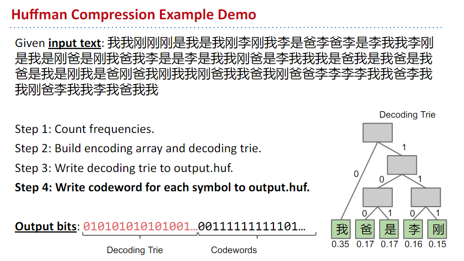
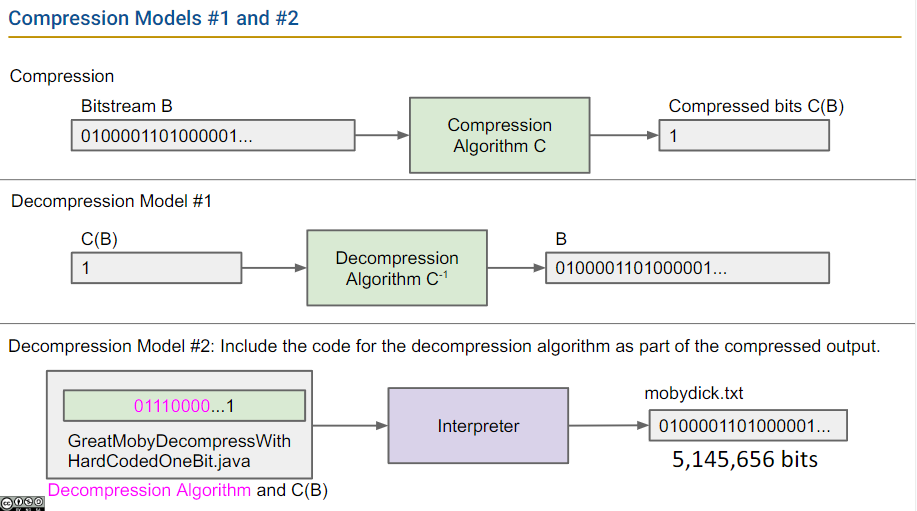

# week 15 lectures notes

## 38. 压缩算法

- 霍夫曼编码的压缩过程，[demo示例](https://docs.google.com/presentation/d/1DWuSkE9MxQPUTjbSJCMe54rCim4eAwM4aFRvhqq5_Hs/edit#slide=id.g2159afc5e6_0_290)：
  1. 假设输入是文本，先统计文本中每个字符（Character）的出现频率；
  2. 构建解码用的 Trie，以及编码数组（BitSequence[]，以字符为索引，以该字符编码后的比特序列为值）
  3. 将解码用的 Trie 写入 output.huf
  4. 将每个字符对应的编码后的 bits 写入output.huf

- 霍夫曼编码的解压缩过程：
  1. 读取解码用 Trie 的 bits，构建出 Trie 结构
  2. 读取编码后的比特，作为 Trie 的 `longestPrefixOf` 方法的参数，调用 `longestPrefixOf` 直到所有编码后的比特都还原为未压缩的形态

- 实际运用霍夫曼编码面临两个选项：
  1. 是针对每一种类型的输入（如英文文本、中文文本、Java code、图片等），汇集巨量的输入样本，构建出各自的编码方案（英文文本编码方式、中文文本编码方式）
  2. 还是每个输入文件单独处理，并将压缩该文件的代码连同压缩后的内容打包到一起作为最终结果。
  - 目前通用第二种方案。

- 自解压：解码过程的一种实现模式，将解码用的算法代码和压缩后的文件内容放在一起（如一个 Java 文件中），将文件交给解释器，就能生成压缩前的文件。

对比自解压和上述霍夫曼编码的普通解压过程：

## 39. 压缩算法的复杂度和 N=NP? 问题

- Kolmogorov Complexity 柯氏复杂性
- Space/Time Bounded Compression
- N=NP?

这几个议题有点难，Josh 对它们做了描述，没有讲细节信息，这些问题具体在 CS170 这门课中详细讨论，这次学习我先放过。