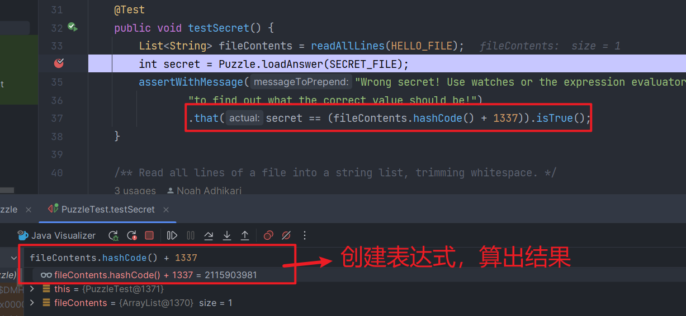

# lab05 深入探究 Git 和 Debugger 的用法

[Lab 05: Advanced Git and Debugging](https://sp23.datastructur.es/materials/lab/lab05/)

- Git： 解决本地分支与远程分支文件的冲突。需要配合 Grandscope 课程评分系统使用
- Debugger：在调试中使用表达式

## Git 解决分支合并冲突

分支合并与冲突解决我在工作中已有接触。代码冲突一般发生在分支合并时，两个分支修改了同一个文件的同一处代码，Git 无法用 fastforward 的方式合并，需要人工解决，假设本地分支 `features/simon/20230401`，推送到远程同名分支，远程分支 `features/simon/20230401` 合并到 `develop` 分支发生冲突，一般做法是：

1. 切换到本地分支 `features/simon/20230401`；
2. 将远程分支拉到本地分支 `git pull origin develop`，此时 git 会提示产生冲突，并告诉你具体的冲突文件，"CONFLICT(content) :  Merge conflict in src/conflict/hello.txt"。用 git status 也可以看到产生冲突的文件；
3. 打开有冲突的文件，会发现 Git 把产生冲突的部分都列出来了，`<<<<<<< HEAD` 和 `=======` 区域的代码是当前分支的提交，`=======` and `>>>>>>> 538409c...` 是引入的分支的提交，判断需要保留的部分，将另一部分删除；
4. 处理完所有冲突文件后，提交这些改动 `git add .`、`git commit -'resolve conflict'`。一般一个提交对应一个父级（上一个提交），但这个合并的提交，它的父级同时是前两个分支的提交。
5. 此时再将当前分支推送到远程同名分支，然后让它合并远程的 `develop` 分支，就能正常合并了。

## 在 Debug 时使用表达式

Debugger 的进阶部分介绍了表达式和 watch 的用法，在调试过程中可以用当前的变量创建表达式，对出错的上下文进行推断。

这部分要求通过 debug 得出能够通过断言的值，如下图：

图中需要通过的断言是：`secret == (fileContents.hashCode() + 1337)`，`secret` 的由被测试程序产生，`fileContents.hashCode()` 的值可以通过打断点，然后输入表达式计算得到，得到的值是 `2115903981`，然后查看 `Puzzle.loadAnswer()` 代码，发现它的功能就是读取文件的第一行返回，文件的内容来自 `secret.txt`，于是将 `secret.txt` 的内容改为 `2115903981` 就通过了测试。

主要在联系 Debug 时，使用表达式调试变量的不同值。