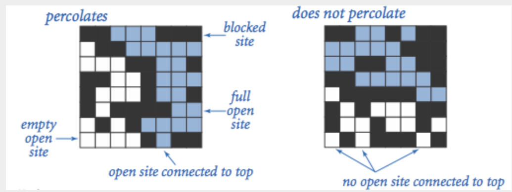

# week6 assignment 为“渗流”建模

完成 [hw02](https://sp23.datastructur.es/materials/hw/hw2/)，一个为“渗流”功能建模的 Percolation 类。

## 什么是渗流

渗流现象：给一个由随机分布的绝缘和金属材料组成的复合系统，问其中的金属比例得是多少，才能使复合系统成为一个电导体？或者，给一个表面有水（或下面有油）的多孔景观，在什么条件下，水能够流到底部（或油能够涌到表面）？科学家用“渗流”为这些情况抽象建模。

渗流模型：我们用一个 N × N 的点位(site)网格来模拟一个渗滤系统。每个点位有两种状态，要么开放（open），要么封封闭（blocked）。如果一个开放点位可以通过相邻的（左、右、上、下）开放点位一直链接到顶部的开放点位，那么我们叫它是完全点位（a full site），底排只要有一个完全点位，我们就说该系统是渗滤的。对于绝缘/金属的混合材料来说，开放点位就是材料中的能导电的金属部分，一个渗流系统就让材料形成一个从上到下的导电路径；对于多孔材料来说，开放点位就是的水可能流过的空隙，一个渗滤的系统能让水从上到下流经开放的空隙。

下图中的蓝色方块就是完全点位（能够连到顶部的开放点位），左边的 8 × 8 网格是渗滤的（percolate），右边的没有渗滤。渗流问题求的就是当网格中的开放点位的比例达到多少是，整个网格会渗流。这次作业的要求使用不交集数据结构为渗流过程建模，实现 `Percolation.java`



## 渗流的实现 Percolation.java

API 说明如下：

```java
public class Percolation {
   public Percolation(int N)                // create N-by-N grid, with all sites initially blocked
   public void open(int row, int col)       // open the site (row, col) if it is not open already
   public boolean isOpen(int row, int col)  // is the site (row, col) open?
   public boolean isFull(int row, int col)  // is the site (row, col) full?
   public int numberOfOpenSites()           // number of open sites
   public boolean percolates()              // does the system percolate?
}
```

根据 API 的说明能实现大部分的方法，思路有两个：1）用一维数组（而不是二维数组）模拟 N × N 中每个网格的开放形状，数组保存布尔值，true 表示开放，数组索引要和网格索引（int row, int col）建立映射；2）用课程提供的 [` WeightedQuickUnionUF`](https://algs4.cs.princeton.edu/15uf/WeightedQuickUnionUF.java.html) 类追踪网格是否完全。

实现过程会遇到两个问题：

### 1. 如何判断一个点位是否完全，系统是否渗滤？

一个完全点位能够通过其相邻的开放点位一路直达顶部的某个开放点位。课程提示，额外增加两个点位，一个模拟顶部节点，一个模拟底部节点，判断一个点位是否完全就是这个点位和顶部节点是否在一个集合内，判断系统是否渗滤就是判断底部节点是否和顶部节点在一个集合内。

### 2. 如何解决引入顶部、底部虚拟节点的做法带来的反冲问题？

一种方法来自 Josh Hug 提示：创建一个 `WeightedQuickUnionUF` wqu2，这个实例不去连接虚拟的底部节点，查询 `percolates()` 时用连接了底部虚拟节点的 wqu，查询 `isFull(int row, int col)` 时用 wqu2。这意味在 open() 方法内，wqu 的操作再一模一样地执行到 wqu2 上。

我用了另一种方式实现，参考自 [stack overflow 上的回答](https://stackoverflow.com/questions/61396690/how-to-handle-the-backwash-problem-in-percolation-without-creating-an-extra-wuf)，弃用了顶部和底部虚拟节点，而先对节点的状态继续约定，一个节点共有 5 种状态：


(图来自上述问题下的回答)

然后用 `byte[] sites` 追踪节点的状态，节点改变状态时，做的是二进制的 OR 操作（|），这种实现方式的逻辑基本上全都在 `open()` 方法内，它的具体过程：
    1. 计算行列对应的数组索引 index，将 `sites[index]` 先设为 4。4 对应二进制的 `100`，代表节点 open 状态，且不连接顶部，也不连接底端；
    2. 检查这个节点是否是顶部节点，或者底部节点，是的话修改为对应的状态，此时我们得到节点新状态 `newStatus`
    3. 检查这个节点是否要与周围的节点合并：
        - 获取这个节点周围的 4 个节点位置；
        - 分别找到这 4 个节点在不交集结构中的 root，获取这些 root 的状态，做二进制 OR 运算，得到一个合并后的状态 `mergedStatus`；
        - 将节点与这 4 个节点合并，合并后隐含结果是节点与它的邻居节点会有相同的 root
    4. 将节点的新状态与邻居节点们的合并状态再做一个二进制 OR 运算，得到最终的状态；
    5. 将这个最终的状态赋给节点的 root，由于节点和邻居们合并过，所以邻居们的根就是节点的根。
    6. 检查这个最终的状态是否等于 7，是的话说明整个网格已渗滤。

代码如下：

```java
public void open(int row, int col) {
    if(isOpen(row, col)) {
        return;
    }
    // 计算新状态--自身状态
    int index = rcToIndex(row, col);
    sites[index] = 4;
    // 检查顶部或底部节点
    if(index < N) { // top site
        sites[index] = 6;
    } else if (index >= N * (N - 1)) { // bottom site
        sites[index] = 5;
    }

    openedSites += 1;

    // 获取周围节点的 root 节点的状态的合并状态
    byte mergedStatus = 0;
    int[][] neighbors = getNeighbors(row, col);
    for (int[] neighbor : neighbors) {
        int r = neighbor[0];
        int c = neighbor[1];
        if (isValidGrid(r, c) && isOpen(r, c)) {
            int rootIdx = union.find(rcToIndex(r, c));
            mergedStatus = (byte)(mergedStatus | sites[rootIdx]);
            union.union(rootIdx, index);
        }
    }
    // 计算最终状态，赋给新的 root 节点
    // 节点的是否连接到 top 或者 bottom 的信息保存在所在集合的根节点上。也可以保存到节点自身
    mergedStatus = (byte)(mergedStatus | sites[index]);
    int newRootIndex = union.find(index);
    sites[newRootIndex] = (byte)(sites[newRootIndex] | mergedStatus);

    if(sites[newRootIndex] == 7) {
        isPercolated = true;
    }
}
```

方法中运行时主要消耗在不交集结构的操作，具体是 5 次不交集的 `find` + 4 次不交集的 `union`，经过路径压缩优化的 WeightedQuickUnion 的连接和查询操作是常量时间，因此这种实现的运行时也可以答道常量。

## 蒙特卡洛模拟 Monte Carlo Simulation

实现 Percolation 后，这个作业接着会拿它做蒙特卡洛模拟，模拟的步骤：

1. 初始化一个 N × N 的网格，其中所有点位都封闭；
2. 重复以下步骤，直到系统出现渗滤：
    - 2.1 在封闭的点位中随机选择一个点位
    - 2.2 打开该点位
3. 当系统发生渗滤时的被打开的点位，占所有点位的比例，就得到了一个该系统的渗滤阈值的估计值。

如，在一个20 × 20的网格中相继打开点位，那么可以得到渗滤阈值的估计值是 204/400=0.51，表示第 204 个点位打开时系统就会渗滤。

我自己跑的测试结果是 `0.59`。

作业的最后有一次运行时计时，用 StopWatch 记录 WeightedQuickUnionUF 和 QuickFindUF 两个不交集结构实现之间的性能差异，跑了一次，用 WeightedQuickUnionUF 在 N=100 时跑 `0.26s`，N=1000 时，跑 `16s`；QuickFindUF 在 N=100 时跑 `1.98s`，N=1000 时，跑了 5 分钟还没结果，看了一下它的实现，`union` 和 `isConnected` 的运行时是O(N)，原来 O(N) 的运行时在现实生活中就让人等不了。