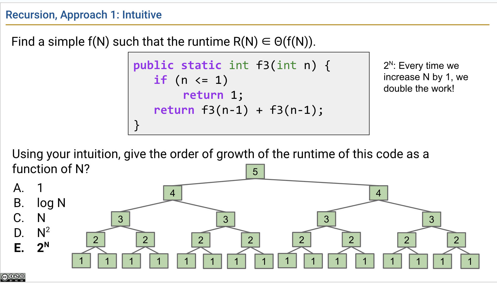

# week6 lectures

（备注：best case 和 worst case 指相同算法在不同形态的 N 下的表现，比如一个排序算法，当输入一个已经排好序的数组时，这种情况下算法的通常叫 best case；对于一个查找算法，执行一次就找到需要的值，就是 best case）

## lecture 15 渐进分析2

算法的运行时分析指分析算法随着输入规模（ input size）的增加造成的级数的增长（order of growth）情况。Josh Hug 提醒大家分析算法的运行时不是看一看就能得到结果，要具体问题具体分析，要着手进行运算，这次课程Josh Hug 带领大家分析循环、递归、二分查找、合并排序等算法的运行时，给大家积累通用算法的分析经验。

1. 分析嵌套的循环(nested loop)

假设有一个嵌套循环的算法，但其外层 i 增长是按指数级别的增长，问它的运行时怎么算，示例代码如下：

```java
public static void printParty(int N) {
    for (int i = 1; i <= N; i = i * 2) { // 外层 i 按照指数级增长
        for (int j = 0; j < i; j += 1) {
            System.out.println("hello");
            int ZUG = 1 + 1;
```

下面用三种方式分析上述代码的运行时

1.1 直觉

看代码的实现，凭经验和直觉分析它的运行时。

（附我的判断：一般来说嵌套循环的运行时一般是 N^2，但这个例子的外层循环的增长不是 N，而是指数级的增长，所以它的算法运行时应该是 "外层循环的增长 * N"，外层循环的增长怎么算，我认为是 logN，所以整个算法的运行时是 NlogN）

1.2 计数

计算不同取值的 N 下（1、2、3、5...）的算法中的某个步骤的操作数量，从中得出规律。


（图源自 lecture 15 slide，下同）

如上图所示，从最下面的表格中得出的结论是，只有当 N 发生一次以2为底的指数级别的增长时，算法的操作数才发生变化。上图中左上角 6*6 的网格中第 i 行（含i）以上的有色格子的个数表示 N 为 i 时的算法的某个步骤的计数。

用代数式表达其中的规律是：

C(N) = 1 + 2 + 4 + ... + N，在 N 是以 2 为底的指数级数的情况下，而 1 + 2 + 4 + ... + N = 2N - 1

1.3 数学推理

对不同的 N 进行操作数量的计数得到的增长关系进行进步一分析，可以得到一个结论，这种增长关系总是处于 0.5N ~ 2N 的区间内。如下图所示：


（图源自 lecture 15 slide）

由于这种增长永远落在两个线性增长的范围内，因此它也是一种线性增长。

所以它的 runtime 是 θ(N)。

2. 分析递归

树递归（tree recursion）的分析

递归调用是调用帧的在栈上的叠加，我们把调用帧（frame，或执行上下文）的增加作为算法运行时的计数，这里假设每个调用帧的 runtime 都是常数。

分析下面这个递归调用算法的运行时：

```java
public static int f3(int n) {
    if (n <= 1) return 1;
    return f3(n-1) + f3(n-1);
}
```

每个函数调用都会新增两个自身函数调用，一生二、二生四、四生八这样的增长，算法的图示如下：



用文字描述是，N 每增加 1，总工作量会增加 1 倍，增加 1 倍就是在当前的数量上乘以 2；
用数学表示是指数级别的增长，C(N) = 2 ^ N;

除了这种直觉上的分析，可用数学计算：


- N=1，总数 1
- N=2，总数 2
- N=3，总数 1 + 2 + 4
- N=4，总数 1 + 2 + 4 + 8
- N=n，总数 1 + 2 + 4 + ... + 2 ^ (n-1)

根据下图计算公式，得到该算法的运行时时 `2^n - 1`


3. 分析二分查找

在一个已排序的数组上查找一个值的算法，运行时 logN，logN 的算法在 N 很大的情况下运行起来也极快。

4. 分析合并排序（merge sort）

Merge：操作是指将两个已排序的数组合并成一个数组，做法是不断从两个数组中获取较小值，加入新数组，可参见[数组的合并过程演示](https://docs.google.com/presentation/d/1mdCppuWQfKG5JUBHAMHPgbSv326JtCi5mvjH1-6XcMw/edit#slide=id.g463de7561_042)，合并操作的运行时是O(N)。


当不断将一个数组二分，直至只剩下 1 个元素，剩下的操作就是合并的操作。

以下是 merge sort 的实现：

```java
public void mergeSort(int[] arr) {
    int length = arr.length;
    if(length <= 1) { // do nothing
        return;
    }
    int mid = length / 2;

    int[] leftArr = new int[mid];
    int[] rightArr = new int[length - mid];

    // populate left half and right half, use common for loop
    for(int i=0; i<mid; i++) {
        leftArr[i] = arr[i];
    }
    for(int j=0; j<length - mid; j++) {
        rightArr[j] = arr[mid + j];
    }

    // 分别对两边进行 mergeSort
    mergeSort(leftArr);
    mergeSort(rightArr);

    merge(arr, leftArr, rightArr);
}

// merge two sorted arr to one arr
public void merge(int[] arr, int[] leftHalf, int[] rightHalf) {
    int leftLen = leftHalf.length;
    int rightLen = rightHalf.length;
    
    int i = j = k = 0;
    while(i < leftLen && j < rightLen) { // 两者只要一个遍历完，即退出
        if(leftHalf[i] <= rightHalf[j]) { // 取左边数组的值
            arr[k] = leftHalf[i];
            i += 1;
        } else {
            arr[k] = rightHalf[j]; // 取右边数组的值
            j += 1;
        }
        k += 1;
    }

    // 将左边或右边数组剩余的数填充到新数组
    while(i < leftLen) {
        arr[k] = leftLen[i];
        i += 1;
        k += 1;
    }
    while(j < rightLen) {
        arr[k] = rightLen[j];
        j += 1;
        k += 1;
    }
}
```