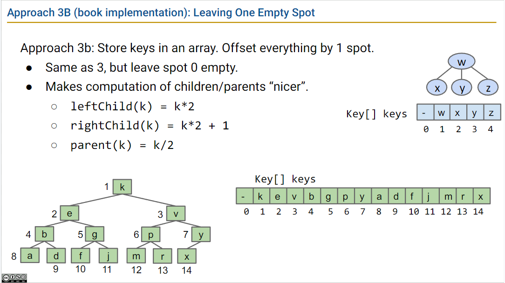

# week8 lectures

## lecture 19-20 哈希

- 之前我们使用查找树结构实现 Set 和 Map，基于查找树（特别是LLRB）的实现能让添加和查询的操作运行时达到 O(logN)，但依赖一个前提时，元素必须是可比较的。
- 哈希表（hash table）是一种不需要比较元素，并且性能达到近似常数级别的数据结构实现。
- 哈希表的底层结构是链表构成的数组，里面存的元素在所有链表中都不重复，也叫 Array of LinkedListSet
- 哈希码（hash code）的作用是将集合A 中的一个值映射到集合B中的一个值，集合A 的范围极大近乎无限，集合B的范围是有限的。比如，将字符串经过相应的哈希函数处理，得到一个整数，这个整数就是该字符串的哈希码，字符串的数量是无限的，而 Java 中的整数是有限的（-21亿到21亿之间）

- 哈希表存元素的过程如下图：
    - 数据经过哈希函数得到它的哈希码
    - 哈希码通过 reduce（取模，Math.floorMode）得到数组的索引
    - 将数据保存到索引对应的链表中


(图源来自 lecture 20 slides)

- 数组的扩容：哈希表使用了数组作为容器，在实际使用时要设初始大小 M，并且达到元素数量 N 达到一个比例后(N/M)，进行数组扩容
    - Java 的 HashSets 的数组初始大小时 16，当 N/M 大于 0.75 时，进行数组扩容
    - 数组扩容以指数增长的方式，M = 16, 32, 64, 128...
    - 如果数组某个索引的链表的元素太多，Java 会把这个位置的链表改成一棵红黑树

- 哈希码如何影响元素在数组中的分布情况，使得在哈希表中不会出现某些链表特别长，某些链表特别短
    - Java 默认的哈希函数 `hashCode()` 获得到的是对象的内存地址，而对象的内存地址是随机的，使得经过 reduce 之后的数组索引也能均匀分布，不会扎堆。

- 如果两个对象通过 equals() 判断是相等的，它们也应该要有相同哈希码，这是为了能正确地哈希表中查到它。意思是，当覆盖默认的 equals() 实现时，也要相应修改 hashCode() 实现，使得两个对象相等时，它们的 hashCode 也相同。

- 尽量不把可变数据类型用作哈希表中的 key，即使用了，也不要修改它。
    - 可变数据与不可变数据：不可变数据类型指当一个实例初始化完成后，不会发生任何可见的改变，Integer, String, Date，都是不可变数据类型，之前自己实现的 ArrayDeque, Percolation 类是可变数据类型。
    - 可变数据类型进行修改后，它的哈希码也会修改，因此查询哈希表的时候会 break
    - 不可变数据类型，优点是使用起来无后顾之忧，缺点是每次要发生改动，就得创建一个新的对象，如每次拼接一个段 String，就会创建新的包含已有内容和新的内容的 String 对象。

## lecture 20 堆与优先队列

### 优先队列

一种 ADT，用于追踪 “smallest”, “largest”, “best” 等之类的元素。

```java
/** (Min) Priority Queue: Allowing tracking and removal of the
  * smallest item in a priority queue. */
public interface MinPQ<Item> {
	/** Adds the item to the priority queue. */
	public void add(Item x);
	/** Returns the smallest item in the priority queue. */
	public Item getSmallest();
	/** Removes the smallest item from the priority queue. */
	public Item removeSmallest();
	/** Returns the size of the priority queue. */
	public int size();
}
```

### 堆

- 堆是一种特殊的树结构
- 二分最小堆（binary min-heap）：一个具有**最小堆属性**的**完全**二分树：
    - 最小堆：每个节点都小于等于它的子节点
    - 完全树：只在最底层出现缺失的节点，每个节点都尽可能向左叉。

- 堆的操作：
    - 插入：插入到底层，然后和父节点比较，向上浮动（swim），直到它大于等于父节点。


### 堆的实现

- 把一个堆转成树，只要从上到下、从左到右读取值，然后一次插入数组从 1 开始的位置即可。如下图：



换句话说，任何一个从小到大排列的数组，就能看成一个最小堆，从大到小排列的数组是个最大堆


### 课程至此提到的数据结构及实现

