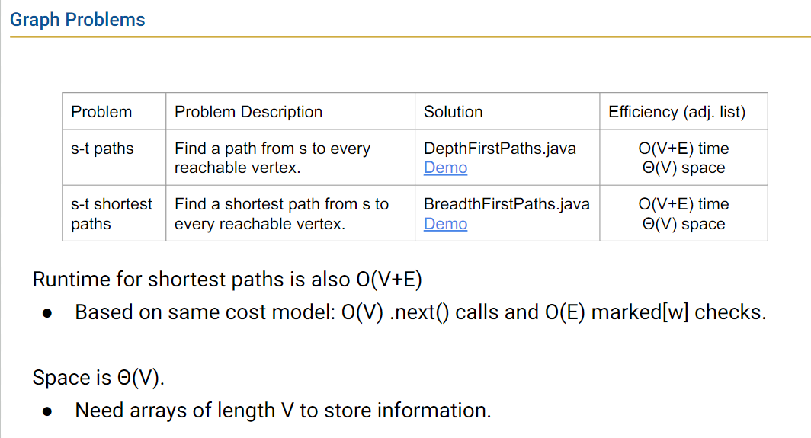

# week9 lectures

## lecture 22-23: 树、图的遍历及实现

图（Graph）是一种比树更通用的结构，相关术语有：


- vertice：图的顶点，也叫节点(node)；
- edge：边，表示一对顶点；
- path：路径，由多条边连起来的系列顶点（a sequence of vertices connected by edges）
- cycle：起始顶点和最终顶点是相同的路径（a path whose first and last vertice are the same）
- connected: two vertices are connected if there is a path between them. The graph is connected if all vertices are connected.
- connected component: sub-graph that has all vertices connected
- degree: 一个节点连接的边数是它的 degree

**与图相关的有名问题**：
    - s-t Path: 有没有从节点 s 到节点 t 的路径
    - shortest s-t Path: 从 s 到 t 的最短路径
    - Connectivity: 图是否连接
    - Biconnectivity: Is there a vertice whose removal disconnects the graph?
    - cycle detection: 检测是否有环结构
    - Euler Tour: 图中是否存在环，使每个边恰好使用到一次
    - Hamilton Tour: 图中是否存在环，使每个顶点恰好用到一次
    - Isomorphism: 两个图是否同构

Euler Tour 和 Hamilton Tour 看起来很像，但解法大不相同， Euler Tour 有 θ(# edges) 的算法，而目前最快的 Hamilton Tour 算法是指数时间。

与图相关的问题大多涉及到遍历图，通常是在遍历图的过程中进行一些操作来解决。而遍历图的方式（与遍历树类似）有：

- 深度优先遍历
    - 前序遍历
    - 后续遍历
- 广度优先遍历

### 深度优先搜索 Depth First Search

深度优先遍历是种概括的说法，指依次遍历完所有邻居节点的子图（sub-graph）的方式，核心过程是深度优先搜索。

深度遍历搜索常用于解决：
  - s-t connectivity 问题
    - 目标：找出源节点 s 和目标节点 t 是否连接
  - all paths from s 问题：
    - 目标：找到从 s 点出发到图中所有节点的路径

- s-t connectivity 问题的一种算法过程：connected(s,t)，或见[s-t connectiviy 解法过程示例](https://docs.google.com/presentation/d/1OHRI7Q_f8hlwjRJc8NPBUc1cMu5KhINH1xGXWDfs_dA/edit#slide=id.g76e536eb1_0_160)
  - 标记 s;
  - 如果 s == t，返回true；
  - 否则，对所有未标记的 s 的邻居执行 connected(v,t)，如果有任何邻居是 t，返回 true；
  - 返回 false

- all paths from s 问题的一个算法过程：dfs(v)，或见[寻找节点s的所有路径解法过程示例](https://docs.google.com/presentation/d/1lTo8LZUGi3XQ1VlOmBUF9KkJTW_JWsw_DOPq8VBiI3A/edit#slide=id.g76e0dad85_2_380)
  - 标记 v；
  - 对 v 的每个未标记邻居节点 w 执行：
    - 设置 w 的来源为 v，`edgeTo[w] = v`
    - dfs(w)

- 选择邻居时，按一个规则来即可，如每次选择最小 key 的邻居
- 上述算法都要维护两个数组，一个标记是否已访问（marked），一个保存边（edgeTo），保存边的数组指，数组的每个索引位置保存它的来源，如，从 0 节点开始，得到它的最小邻居节点是 1，保存边的操作是将节点 1 的来源设为节点 0 `edgeTo[1] = 0`。

- 深度优先的前序遍历：在对邻居节点继续 dfs() 前先进行当前节点的操作，如将邻居节点的来源设为当前节点，处理节点的顺序就是 dfs() 调用的顺序；
- 深度优先的后续遍历：先对邻居节点继续进行深度优先搜索，再进行当前节点操作，处理节点的顺序是  dfs() 返回的顺序；

### 广度优先遍历

广度优先遍历是一层一层地遍历所有节点，同层的节点到开始节点的距离相同。

广度优先搜索常用于解决最短路径类问题。

算法过程，或见[广度优先搜索示例](https://docs.google.com/presentation/d/1JoYCelH4YE6IkSMq_LfTJMzJ00WxDj7rEa49gYmAtc4/edit#slide=id.g76e0dad85_2_380)：
  1. 初始化一个队列（queue），将起始节点s放入队列，标记节点s，这种情境下的队列又叫 fringe
  2. 执行以下过程直到队列为空：
    - 从队列中移除队首节点，v
    - 对于每个未被标记的 v 的邻居节点 w：
      - 标记 w;
      - 设置 w 的来源为 v，`edgeTo[w] = v`，将它的距离设为 v 节点的距离 + 1，`distTo[w] = distTo[v] + 1`，距离指的是距离起始节点的边的多少。
      - 将 w 添加到队列的末尾

### 实现

**图本身的实现**：课程教材中的实现的 Graph API 如

```java
public class Graph {
  public Graph(int V):               Create empty graph with v vertices
  public void addEdge(int v, int w): add an edge v-w
  Iterable<Integer> adj(int v):      vertices adjacent to v
  int V():                           number of vertices
  int E():                           number of edges
...
```

基于这个实现，一个遍历图，打印所有节点的方法：

```java
public static void print(Graph G) {
  for (int v=0; v<G.V(); v++) {
    for(int w: G.adj(v)) {
      System.out.println(v + ' - ' + w);
    }
  }
}
```

- 实现图的底层数据结构：
  - adjacency matrix 临接矩阵，n × n 的矩阵，n 是节点数量，每一行表示一个节点与所有其他节点的连接情况，有连接为 1，没连接为 0，如 0行1列为 1 表示，节点0指向节点1。缺点，空间浪费，运行效能低，遍历操作的的运行时 θ(v^2)
  - adjacency list 临接列表，最常见的图结构底层实现，实现思路类似哈希表，数组的索引及节点的key，数组的值保存节点的所有邻居的key。这种实现来跑上面的遍历算法 print 的运行时分析，假设 V 是所有节点数，E是所有边数：
    1. best case：所有节点都孤立，没有连接，只要遍历一次所有节点，无其他操作，θ(V)
    2. worst case：所有节点都和其他节点连接，需要遍历所有节点，每次遍历再遍历节点的所有邻居，θ(V^2)
    3. 在这样的上界和下界下，总体运行时是 θ(V+E)。为什么 V+E 不在化简为类似类似 V+V=2V，从而得到 θ(V)的结论？因为，图的节点数和边数是独立计算的，两个数量没有关系，当一个图很稀疏时，决定运行时的是节点数量，当一个图很密集，节点之间联系众多时，决定运行时的是边数，所以两者在运行时中的比重都不可忽视。

**图遍历的实现**

实现遍历图的常见套路：将遍历功能独立实现为类：
  - 创建一个图对象
  - 将图对象传入一个处理图的客户类（client class，使用图 API 来实现功能的类，相当于图的客户）的图处理方法（或它的构造函数）
  - 查询客户类获取处理图的信息

一个处理图的所有边的客户类 Paths 如：

```java
public class Paths {
  public Paths(Graph G, int s); // Find all paths from G
  boolean hasPathTo(int v); // is there a path from s to v?
  Iterable<Integer> pathTo(int v); // path from s to v (if any)
}
```

以下是一个深度优先搜索的实现（来自课程slides）：

```java
public class DepthFirstPaths {
  private boolean[] marked;
  private int[] edgeTo;
  private int s;
  public DepthFirstPaths(Graph G, int s) {
      // 其他初始化操作
      dfs(G, s);
  }
  private void dfs(Graph G, int v) {
    marked[v] = true;
    for (int w : G.adj(v)) {
      if (!marked[w]) {
        edgeTo[w] = v;
        dfs(G, w);
      }        	
    } 
  }

```

以下是一个广度优先遍历的实现（来自课程slides）：

```java
public class BreadthFirstPaths {
  private boolean[] marked;
  private int[] edgeTo;
	
  private void bfs(Graph G, int s) {
  Queue<Integer> fringe = new Queue<Integer>();
  fringe.enqueue(s);
  marked[s] = true;
  while (!fringe.isEmpty()) {
    int v = fringe.dequeue();
    for (int w : G.adj(v)) {
      if (!marked[w]) {
        fringe.enqueue(w);
        marked[w] = true;
        edgeTo[w] = v;
      }
    }
  }
}
```

如果使用临接列表作为图的底层结构，跑上面两个搜索代码时，其运行时是：



课程没有对实现部分做详细解释，这部分放到 Lab2B 让学生自己实作 Graph 本身的实现以及遍历图的客户类的实现。

## lecture 24 最短路径

### Dijkstra's algorigthm

假设有一个有向图，从起始节点 s 开始能通往所有其他节点，那么计算 s 到其他所有节点的最短路径，这个最短路径会是ß什么形态？

结论是：最短路径永远是一棵树（shortest path tree）。可以从树和图的定义理解，树和图都由节点和边组成，不同在于，在一颗树中，从 s 节点出发，只有一条路径通往 t 节点，而在图中，s 节点可以通过多条路径到达 t 节点。对于最短路径来说，两个节点之间的最短路径只有 1 条，所以从 s 节点到 t 节点形成的最短路径是个树结构。

Josh 说这个结论很重要，**最短路径是一棵树**，叫最短路径树，它的边的数量永远是产生它的图的节点数量 - 1（V-1）。

如何生成这棵树？

Josh 讲这块的时候循循善诱，先举了两个基于深度优先搜索实现的例子，它们不符合要求，但容易实现，符合学到这里时的学生已有的认知水平。在两种不合格的算法基础上，提出 Dijkstra's algorigthm，一种基于 best-first-search 的算法。

其核心过程就是对图进行 best-first-search，当访问节点 v 时：
    1. 对于节点 v 相邻节点 w，我们算出 w 的距离，算法是 v 的距离 + v 到 w 的边的权重；
    2. 如果得到的结果比 w 已有的距离更好，则更新 w 的距离、以及到达它的节点，这个更新的过程叫“放松” v-w 这条边（relaxing the edge）

具体实现过程时，用一个优先队列管理访问节点的优先级。

Dijkstra's algorigthm 伪代码：

- PQ.add(source, 0)
- 对于所有其他节点 v，PQ.add(v, infinity)
- while PQ is not empty：
    - p = PQ.removeSmallest();
    - relaxing all edges from p

Relaxing an edge p → q with weight w:
    - if distTo[p] + w < distTo[q]:
        - distTo[q] = distTo[p] + w
        - edgeTo[q] = p
        - PQ.changePriority(q, distTo[q])，更新 q 在 PQ 中的优先级

relaxing 操作的运行时是 O(logN)，主要花在 PQ 重新排列 q 的优先级上。

### A* 算法

- Dijkstra 算法用于生成从一点出发到所有节点的最短路径树，适合无负数边的情况

- A* 算法用于寻找从节点 s 出发到节点 t 的最短路径。
    - 在 Dijkstra 算法基础上加了一个距离目标节点的估算值。
    - 原先在 PQ 中保存的 distance(v, s)，变为 `distance(v， s) + h(v, goal)`

A* 算法相比 Dijkstra 算法的 distTo[] 和 edgeTo[] 两个数组保存的元素都相同，但是 PQ 中保存的节点的顺序不同。
    - 不保证每个节点都会访问到
    - 结果也不是一颗从源节点出发的最短路径树
    - h(v, goal) 叫启发式估算（heuristic estimate），没有指定规则，比如可以是节点之间的维度差，如：

```
h(v, goal) {
    return computeLineDistance(v.latLong, goal.latLong);
}
```

