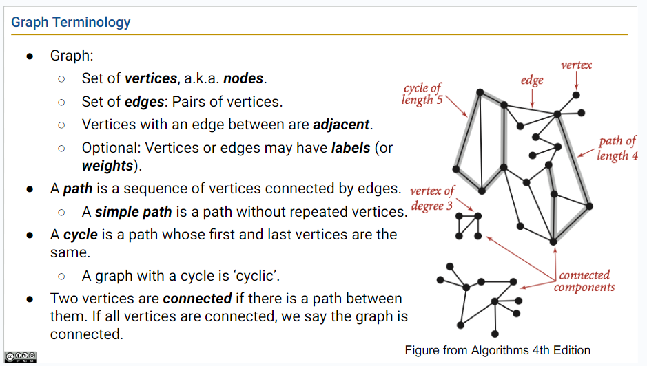

# week9 lectures

## lecture 22-23: 树与图的遍历（Tree and Graph Traversals）及实现

图（Graph）是一种比树更通用的结构，相关的术语有：

- vertice：图的顶点，又叫节点；
- edge：一对顶点；
- path：路径，a sequence of vertices connected by edges
- cycle：a path whose first and last vertice are the same
- connected: two vertices are connected if there is a path between them. The graph is connected if all vertices are connected.
- connected component: sub-graph that has all vertices connected
- degree: 一个节点连接多少边

**与图相关的有名问题**：
    - s-t Path: 有没有从节点 s 到节点 t 的路径
    - shortest s-t Path: 从 s 到 t 的最短路径
    - Connectivity: 图是否连接
    - Biconnectivity: Is there a vertice whose removal disconnects the graph?
    - cycle detection: 检测是否有环结构
    - Euler Tour: 图中是否存在环，使每个边恰好使用到一次
    - Hamilton Tour: 图中是否存在环，使每个顶点恰好用到一次
    - Isomorphism: 两个图是否同构

Euler Tour 和 Hamilton Tour 看起来很像，但解法大不相同， Euler Tour 已有 θ(# edges) 的算法，而目前最快的 Hamilton Tour 算法是指数时间。

与图相关的问题大多涉及到遍历图，通常是遍历图的过程中进行一些操作就能解决诸如 s-t connectivity, path finding 等问题。

与遍历树类似，遍历图也有：
    - 深度优先遍历
        - 前序遍历
        - 后续遍历
    - 广度优先遍历

### 深度优先搜索 Depth First Search

图的深度优先遍历是先遍历完一个邻居节点的子图（sub-graph），再遍历下一个邻居节点的子图。

- 选择邻居，定一个规则即可，如每次选择最小 key 的邻居
- 实现要点：维护两个数组，一个标记是否已访问，一个保存边（edge），保存边的数组具体的实现是，数组的每个索引位置保存它的来源，如，从 0 节点开始，得到它的最小邻居节点是 1，此时将节点 1 的来源设为节点 0 `edge[1] = 0`。
- 深度优先的前序遍历：在对邻居节点继续 dfs() 前先进行当前节点的操作，如将邻居节点的来源设为当前节点，处理节点的顺序就是 dfs() 调用的顺序；
- 深度优先的后续遍历：先对邻居节点继续进行深度优先搜索，再进行当前节点操作，处理节点的顺序是  dfs() 返回的顺序；

使用深度优先遍历采用递归的实现，一个深度优先的先序遍历[解决 s-t connectivity 的示例](https://docs.google.com/presentation/d/1OHRI7Q_f8hlwjRJc8NPBUc1cMu5KhINH1xGXWDfs_dA/edit)

### 广度优先遍历

广度优先遍历是一层一层地遍历所有节点，同层的节点到开始节点的距离相同。

- 

[广度优先遍历示例]()